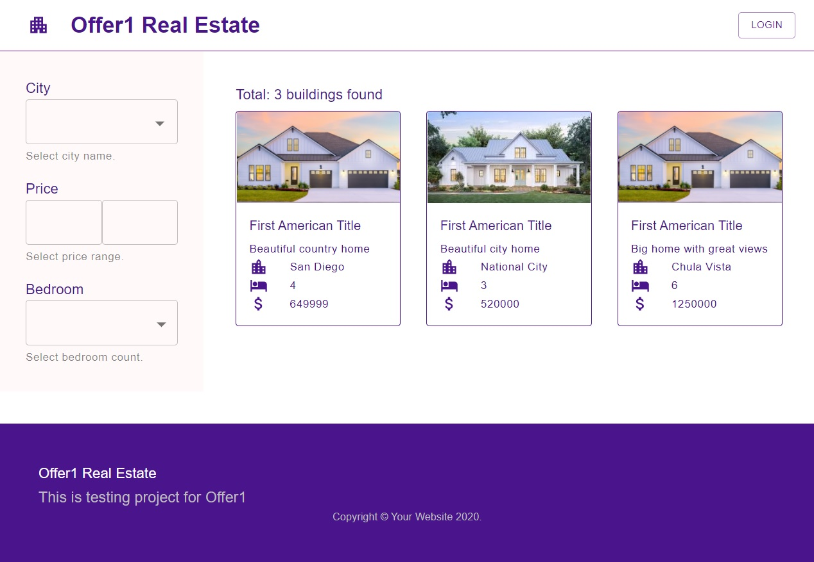

# Clean React Real Estate Template

This project was bootstrapped with [Create React App](https://github.com/facebook/create-react-app) and based on [Material UI](https://material-ui.com/) to give you a quick starting place for the real estate platform.

Live demo is [here](https://offer1-adelin.netlify.app/)

## Features

- View/browse all available homes
- Filter homes by City, Price, Number of Bedrooms
- Show detailed view for a selected home
- Sign-in and Sign-out using react-redux
- Ability to share a home on social media
- Search building with filtering options
- Mobile responsiveness
- Unified theme management with Material Theme Provider

## Solution Details

- Use [Material UI](https://material-ui.com/) & Material UI theme provider
- Use lazy loading for [code splitting](https://reactjs.org/docs/code-splitting.html) and rendering optimization
- Implement [react-redux](https://www.npmjs.com/package/react-redux), [redux-saga](https://www.npmjs.com/package/redux-saga) for global state management & async action handling
- Manage `light` and `dark` theme using [ThemeProvider](https://material-ui.com/customization/default-theme/)
- Customize [axios](https://www.npmjs.com/package/axios) and [interpreter](https://www.npmjs.com/package/axios#interceptors) for REST api implmentation & authentication
- Manage local session data using [store](https://www.npmjs.com/package/store)
- JWT authentication using [jsonwebtoken](https://www.npmjs.com/package/jsonwebtoken)
- Mock API call using [axios mock adaptor](https://www.npmjs.com/package/axios-mock-adapter)
- [CSS-in-JS](https://material-ui.com/styles/api/#createstyles-styles-styles) solution
## Available Scripts

In the project directory, you can run:

### `npm start`

Runs the app in the development mode.\
Open [http://localhost:3000](http://localhost:3000) to view it in the browser.

The page will reload if you make edits.\
You will also see any lint errors in the console.

### `npm run build`

Builds the app for production to the `build` folder.\
It correctly bundles React in production mode and optimizes the build for the best performance.

The build is minified and the filenames include the hashes.\
Your app is ready to be deployed!

See the section about [deployment](https://facebook.github.io/create-react-app/docs/deployment) for more information.

### `npm test`

Launches the test runner in the interactive watch mode.\
See the section about [running tests](https://facebook.github.io/create-react-app/docs/running-tests) for more information.
